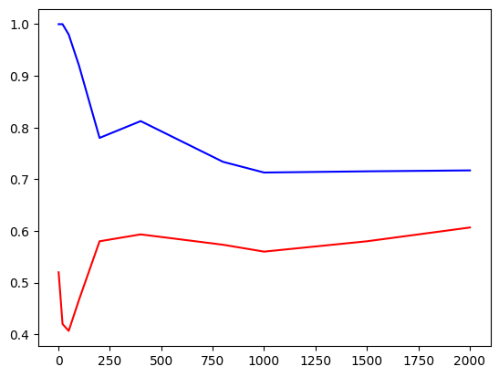
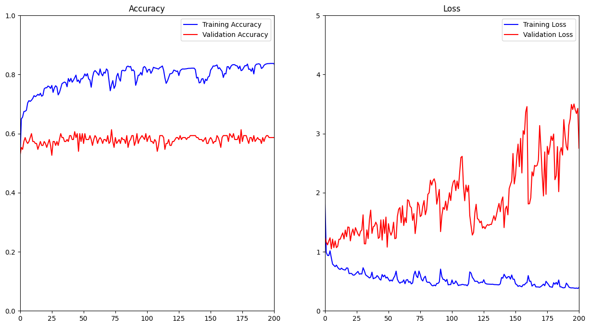
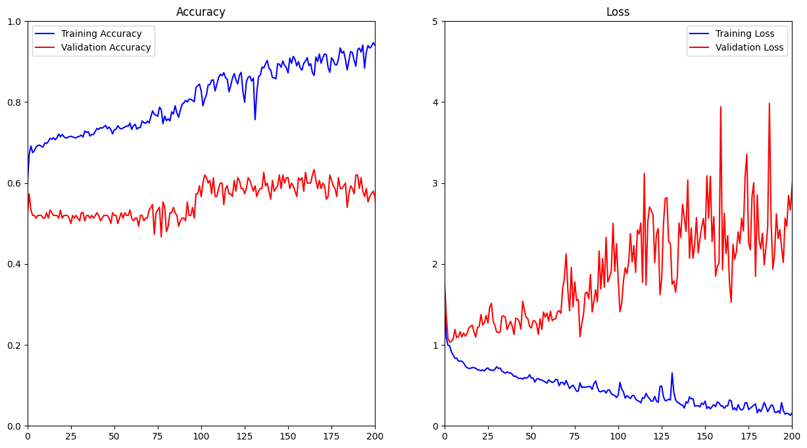
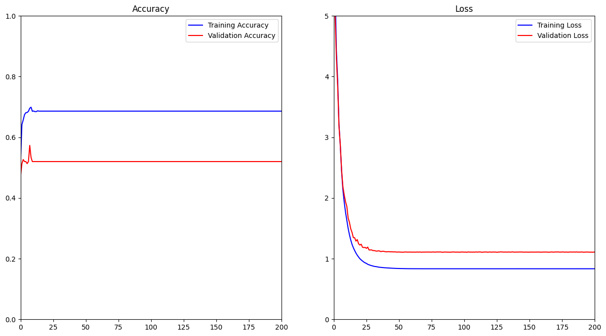

# Melanoma_Classification

A model trained to classify various skin blemishes. This readme will explain some of the process and design intentions. It will also have an update of the progress and decisions made as I learn to modify and optimize the learning model to work better. The project is an ongoing project as I continue to learn more about Tensorflow, and about neural networks.

## Data retrieval and alteration

The dataset is one from kaggle and consists of the following structure:

#### Training set

2000 images(1372 nevus, 374 melanoma, 254 seborrheic)

#### Validation set

150 images(78 nevus, 30 melanoma, 42 seborrheic)

#### Test set

600 images(393 nevus, 117 melanoma, 90 seborrheic)\

To retrieve the data we resize the images to be 200x200 and convert them to greyscale. The result is a (2000, 40 000) shaped array of features, and a (2000, 1) set of labels.
The labels are also each set their own value as we want to use a sparse categorical cross entropy to evaluate the cost of the error in the optimzation. These values range from 0-2

The data is then also regularized using a standard Z-score normilization function. We also shuffle the dataset so that the model is exposed to different examples throughout its training cycle.

## Model Design

#### Iteration 1

Currently I am using a regular Dense neural network. It initially had the following structure:

- Layer 1: 250 units with ReLU activation
- Layer 2: 200 units with ReLU activation
- Layer 3: 150 units with ReLU activation
- Layer 4: 50 units with ReLU activation
- Layer 5: 25 units with ReLU activation
- Layer 6: 10 units with ReLU activation
- Layer 7: 3 units with linear activation\
  This model used the Sparse Categorical Cross Entropy to calculate it's loss and used the data from the logits.
  This model ran into the problem of settling on always predicting the most common value, 0 leading to no change in the resulting prediction

#### Iteration 2

The second iteration was simplified and takes on this structure (Current Model):

- Layer 1: 25 units with ReLU activation
- Layer 2: 15 units with ReLU activation
- Layer 3: 7 units with ReLU activation
- Layer 4: 3 units with linear activation\
  This is the current model that I am currently using to analyze the data and verify that it is working as intended. I am currently updating the process so that I can analyze the training vs validation error and many other attributes that will help me in optimizing the way I create the neural network.

Training Acc (Blue) vs Validation Acc (Red):\

#### Iteration 3

The third iteration was an attempt to increase the complexity and accuracy of the model in the training set, we also want to determine the optimal values for the model. I ran the model for 500 epochs and this was the result:\

We can see here that as the model progressed it reached a peak of about 80% accuracy on the training set. To increase the accuracy we increased the complexity of the model, adding a 50 dense layer ahead of the 25 dense layer:

- Layer 1: 50 units with ReLU activation
- Layer 2: 25 units with ReLU activation
- Layer 3: 15 units with ReLU activation
- Layer 4: 7 units with ReLU activation
- Layer 5: 3 units with linear activation\
  
  We can see the accuracy increase substantially for the training set. In the next iteration we will make an attempt to address the large amount of variance we see in the model. As I increased the complexity I also gave the opportunity for the model to overfit which we can see in this instance.

#### Iteration 4

To counteract the high variance in the model we will first try to apply regularization throughout the model, tuning to address the variance in the model to lower the discrepancy between the training and validation results. With a lambda value of 0.1 the model looks like this:

- Layer 1: 50 units with ReLU activation, regularization of 0.1 (L2 - Weight Squared)
- Layer 2: 25 units with ReLU activation, regularization of 0.1 (L2 - Weight Squared)
- Layer 3: 15 units with ReLU activation, regularization of 0.1 (L2 - Weight Squared)
- Layer 4: 7 units with ReLU activation, regularization of 0.1 (L2 - Weight Squared)
- Layer 5: 3 units with linear activation\
  

From this example we see that the regularization completely counteracted the variance but also created a large amount of bias as the system stabalized and started to predict only one value. We will experiment with different values of lambda to find the optimal value for this regularization parameter.

# To be continued...
